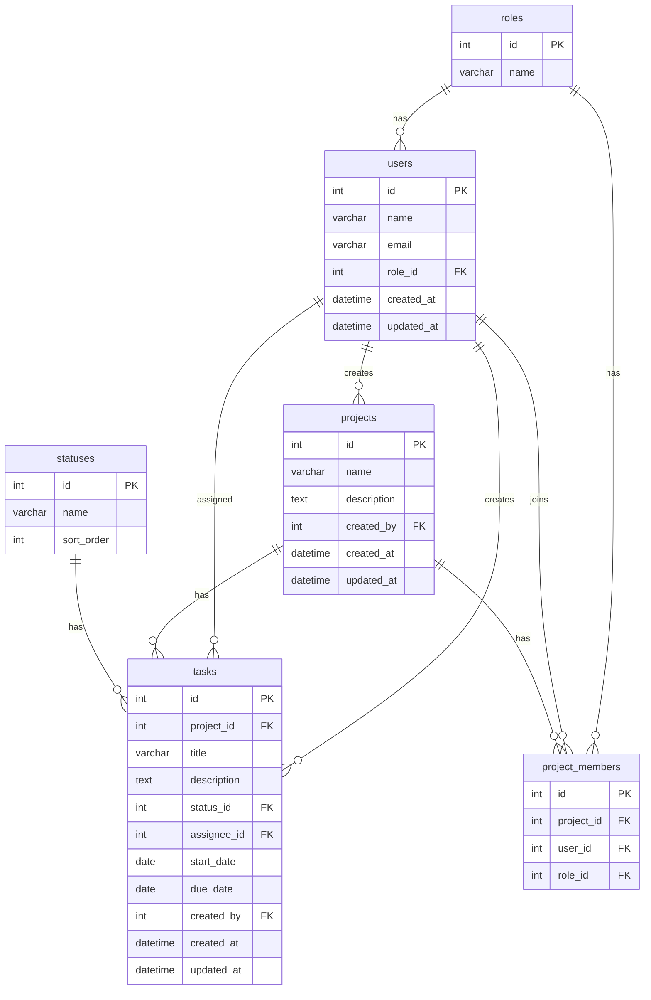

# ER図

## 1. 概要

TM3管理ツールで使用する主要テーブルの関係を整理する。

このER図では、以下のテーブル同士の関係を表す。

- users
- roles
- projects
- project_members
- statuses
- tasks

---

## 2. Mermaid ER図

---

## 3. リレーション説明

| 親テーブル | 子テーブル | 関係 | 説明 |
|---|---|---|---|
| roles | users | 1対多 | 1つの権限に複数ユーザーが紐づく |
| roles | project_members | 1対多 | プロジェクト内の権限を管理する |
| users | projects | 1対多 | 1人のユーザーが複数プロジェクトを作成できる |
| users | tasks | 1対多 | 1人のユーザーが複数タスクを作成できる |
| users | tasks | 1対多 | 1人のユーザーが複数タスクを担当できる |
| users | project_members | 1対多 | 1人のユーザーが複数プロジェクトに参加できる |
| projects | tasks | 1対多 | 1つのプロジェクトに複数タスクが紐づく |
| projects | project_members | 1対多 | 1つのプロジェクトに複数メンバーが参加できる |
| statuses | tasks | 1対多 | 1つのステータスに複数タスクが紐づく |

---

## 4. 補足

- MVPでは、1タスクにつき担当者は1名とする。
- `tasks.assignee_id` は担当者を表す。
- `tasks.created_by` はタスク作成者を表す。
- `projects.created_by` はプロジェクト作成者を表す。
- `project_members` は、ユーザーとプロジェクトの中間テーブルとして扱う。
- `roles` はDirectus側の権限機能で代替する可能性がある。