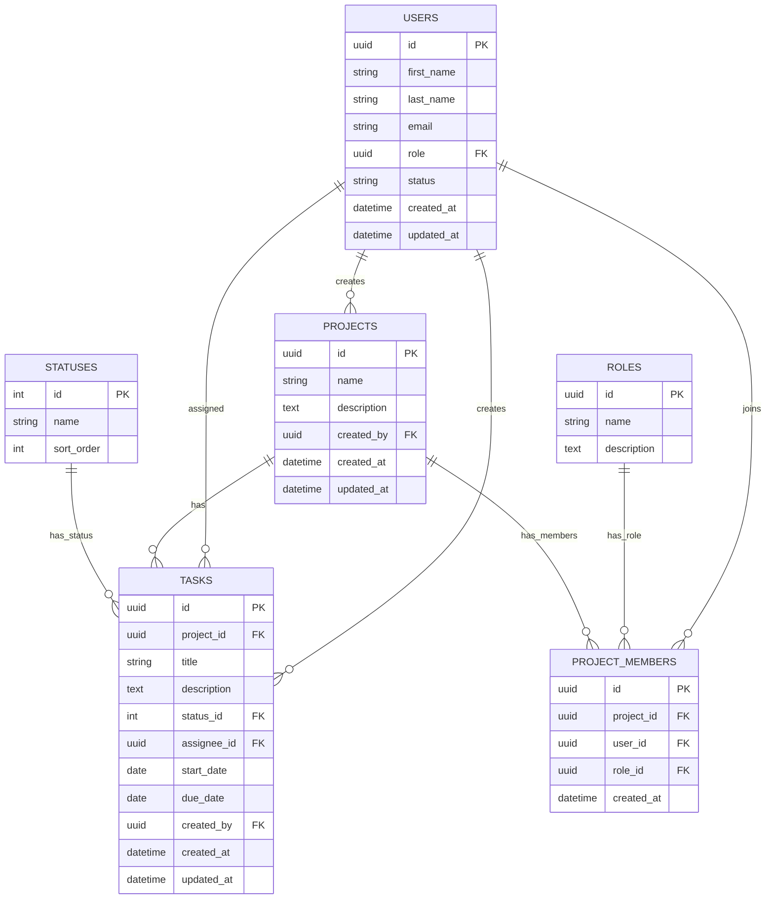

# ER図

## 1. 概要

TM3管理ツールで使用する主要テーブルの関係を整理する。

このER図では、MVPで使用する以下のテーブル同士の関係を表す。

- users
- roles
- projects
- project_members
- statuses
- tasks

MVPでは Directus を使用する方針のため、users と roles は独自テーブルとして作成せず、Directus標準のユーザー管理・権限管理を使用する。

ただし、projects、project_members、tasks から参照されるため、ER図上では users / roles も参照対象として記載する。

---

## 2. Mermaid ER図



---

## 3. リレーション説明

| 親テーブル | 子テーブル | 関係 | 説明 |
|---|---|---|---|
| users | projects | 1対多 | 1人のユーザーが複数プロジェクトを作成できる |
| users | tasks | 1対多 | 1人のユーザーが複数タスクを作成できる |
| users | tasks | 1対多 | 1人のユーザーが複数タスクを担当できる |
| users | project_members | 1対多 | 1人のユーザーが複数プロジェクトに参加できる |
| roles | project_members | 1対多 | 1つの権限が複数のプロジェクト参加情報に紐づく |
| projects | tasks | 1対多 | 1つのプロジェクトに複数タスクが紐づく |
| projects | project_members | 1対多 | 1つのプロジェクトに複数メンバーが参加できる |
| statuses | tasks | 1対多 | 1つのステータスに複数タスクが紐づく |

---

## 4. 多対多の関係

### users と projects

users と projects は、直接つなぐのではなく、project_members を通して管理する。

これにより、1人のユーザーが複数のプロジェクトに参加でき、1つのプロジェクトにも複数のユーザーを参加させることができる。

```text
users
  ↓
project_members
  ↓
projects
```

つまり、users と projects は **project_members を中間テーブルとした多対多** の関係になる。

---

## 5. 補足

- MVPでは、1タスクにつき担当者は1名とする。
- `tasks.assignee_id` は担当者を表す。
- `tasks.created_by` はタスク作成者を表す。
- `projects.created_by` はプロジェクト作成者を表す。
- `project_members` は、ユーザーとプロジェクトの中間テーブルとして扱う。
- `users` はDirectus標準のユーザー管理機能を使用する。
- `roles` はDirectus標準の権限機能を使用する。
- `roles` は独自テーブルとして作成しない方針。
- カンバン画面では `statuses.sort_order` の順番で列を表示する。

---

## 6. テーブル定義書との対応

このER図は、以下のテーブル定義書と内容を合わせる。

```text
docs/table-definitions.md
```

主キー、外部キー、カラム構成はテーブル定義書を基準とする。